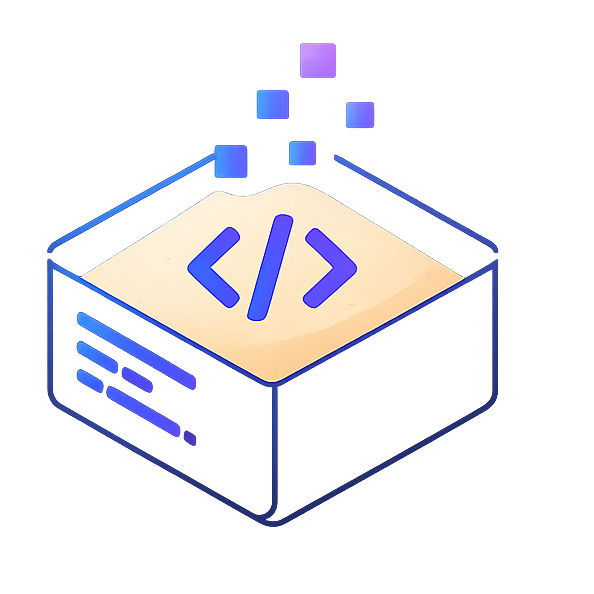

<div align="center">



# AI-Code-Sandbox

### Secure, ephemeral code execution infrastructure for AI agents

Let an LLM write code and run it safely — fully isolated containers, zero network, strict resource limits, instant cleanup — behind one clean API and a v0-style playground.

<br />

[](.github/workflows/ci.yml)
[](sandbox)
[](orchestrator)
[](web)
[](LICENSE)

</div>

---

## The problem

LLMs are great at writing code. Executing that untrusted code on your own infrastructure is the dangerous part — a single generated snippet can exfiltrate data, exhaust resources, or escape into your network. **AI-Code-Sandbox** is the missing execution layer: it runs arbitrary code in throwaway, locked-down containers and returns the output with full telemetry, so your agent never touches the host.

## Highlights

- **Hardened isolation** — every job runs in a dedicated container with `network=none`, a read-only root filesystem, all Linux capabilities dropped, `no-new-privileges`, and a non-root user.
- **Hard resource limits** — cgroup-enforced memory, CPU, and PID ceilings, plus a wall-clock timeout that kills runaway code. Server-side caps clamp every client request.
- **Guaranteed cleanup** — containers are force-removed after each run, with a background reaper as a backstop. Nothing leaks.
- **Multi-language** — Python, Node.js, and Go out of the box, via a one-line registry.
- **AI codegen** — a v0-style prompt composer turns natural language into runnable code (OpenRouter), then executes it in the sandbox.
- **Production-shaped** — clean API gateway with API-key auth, rate limiting, and CORS; structured logs; full test suites; CI; one-command local stack.

## Architecture

```
 Browser ─HTTPS─▶ Orchestrator ─internal HTTP─▶ Sandbox Runner ─Docker API─▶ Ephemeral
 (Next.js)        (FastAPI)                      (Go)                         container
  Vercel           Render          auth,          Docker host    create /     network=none
                                   rate limit,                   kill / reap   read-only rootfs
                                   clamp limits                                cgroup mem/cpu/pids
```

Only the Orchestrator is public. The Runner is private and is the **sole** component permitted to talk to the Docker daemon. Untrusted code only ever executes inside a disposable container.

| Path | Service | Stack | Deploys to |
| --- | --- | --- | --- |
| [`web/`](web) | Playground + marketing site | Next.js 14, Tailwind, Framer Motion, Monaco | Vercel |
| [`orchestrator/`](orchestrator) | Public API gateway | Python, FastAPI | Render |
| [`sandbox/`](sandbox) | Execution engine | Go, Docker SDK | Docker host |
| [`sandbox-images/`](sandbox-images) | Per-language runner images | Docker | registry / local |
| [`infra/`](infra) | Build + smoke scripts | PowerShell / Bash | — |

## Quick start

Requires Docker. From the repo root:

```bash
docker compose up --build
```

- Web playground → http://localhost:3000
- API → http://localhost:8000

Compose builds the language images, wires the Runner to your Docker socket, and starts all three services.

## API

```http
POST /api/v1/execute
Content-Type: application/json
X-API-Key: <key>

{ "language": "python", "code": "print(6 * 7)", "stdin": "", "timeout_ms": 5000 }
```

```json
{
  "job_id": "a1b2c3d4",
  "language": "python",
  "stdout": "42\n",
  "stderr": "",
  "exit_code": 0,
  "duration_ms": 213,
  "memory_kb": 1360,
  "timed_out": false,
  "oom_killed": false,
  "status": "completed"
}
```

| Method | Endpoint | Description |
| --- | --- | --- |
| `POST` | `/api/v1/execute` | Execute code, return output + telemetry |
| `GET` | `/api/v1/languages` | List supported languages |
| `GET` | `/health` | Liveness + upstream readiness |

## Security model

| Layer | Control |
| --- | --- |
| Network | Runner is private; containers run with `network=none` |
| Kernel | Linux namespaces isolate PID/mount/IPC/network; cgroups bound resources |
| Capabilities | `CapDrop ALL`, `no-new-privileges`, non-root user, read-only rootfs |
| Resources | Server-side caps on memory, CPU, PIDs, and wall-clock time |
| Access | API-key auth, per-client rate limiting, restricted CORS, payload limits |
| Persistence | tmpfs-only workspace; container force-removed after each run |

Code is delivered into the container as base64 through an environment variable and decoded into the tmpfs workspace, so no host path is ever mounted.

## Tech stack

- **Go 1.25** — execution engine on the official Docker SDK.
- **Python 3.12 / FastAPI** — async API gateway with Pydantic validation.
- **Next.js 14 / TypeScript / Tailwind / Framer Motion / Monaco** — cinematic UI and editor.
- **Docker** — namespaces + cgroups isolation; pinned Alpine runner images.

## Testing

```bash
cd sandbox      && go test ./...     # Go unit tests
cd orchestrator && pytest -q         # API tests (HTTP layer mocked)
cd web          && npm run test      # component + client tests
pwsh infra/smoke.ps1                  # end-to-end against a running stack
```

CI runs all three suites plus the web build on every push and pull request.

## Deployment

Web → Vercel, Orchestrator → Render, Runner → any Docker-capable host. See **[DEPLOYMENT.md](DEPLOYMENT.md)** for the full guide, including the required environment variables.

## Configuration

| Service | Key variables |
| --- | --- |
| Runner | `MAX_MEMORY_MB`, `MAX_CPUS`, `MAX_PIDS`, `MAX_TIMEOUT_MS`, `MAX_CONCURRENCY` |
| Orchestrator | `SANDBOX_URL`, `API_KEY`, `ALLOWED_ORIGINS`, `RATE_LIMIT_PER_MINUTE` |
| Web | `NEXT_PUBLIC_API_BASE_URL`, `NEXT_PUBLIC_API_KEY`, `OPENROUTER_API_KEY`, `OPENROUTER_MODELS` |

## License

[MIT](LICENSE)
